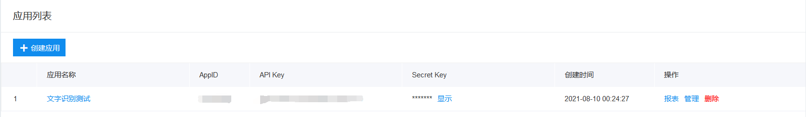
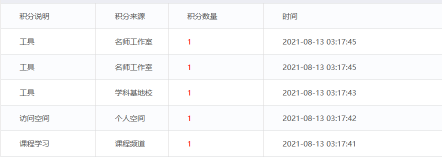

<div align="center"> 
<h1 align="center">之江汇积分助手</h1>
</div>

## 简介

模拟网络请求实现之江汇的积分效果，每日自动帮你签到，最多一日可获得`5`个积分

## 使用方法

#### 01  准备工作

申请百度开发者平台, 获取图片文字识别, 申请地址:

  https://console.bce.baidu.com/ai/?_=1553338619822&fromai=1#/ai/ocr/overview/index

创建一个文字识别应用，并领取免费的资源，申请效果如下：



#### 02 填写配置信息

下载本项目，打开`config.py`文件，填写用户信息和上文获得的`ID API KeySecret Key`

#### 03 运行本项目

一般情况下部署到个人服务器上，并使用`crontab -e`命令添加计划任务，例如

```
7 3 * * * python3 /root/zjh_autoCheck/main.py >> /root/zjh_autoCheck/log.txt 2>&1
### 
2>&1的意思是把错误的输出也输出到标准输出（2表示错误，2>表示错误输出，&表示等同于，1表示正确），因此如果运行出错也会把错误输出到之前定义的log中。
```

第二天就可以查看是否打卡成功了，效果如下所示：



>由于网络原因可能会出现访问超时等不确定情况，建议多设置几条计划任务。
>
>如果没有服务器的可以尝试使用`github actions`功能，后期有时间会改造一下本项目。